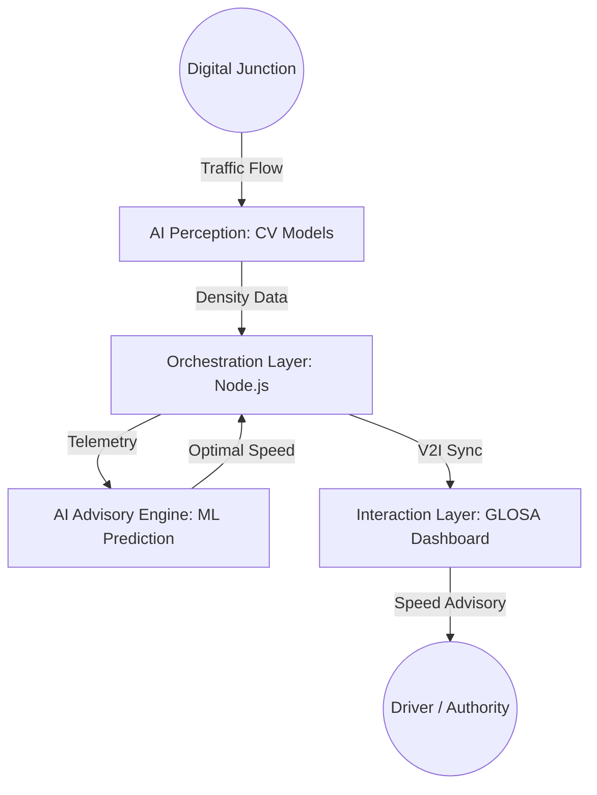

# 🚦 GLOSA-BHARAT 2.0: Intelligent Urban Mobility Ecosystem

[](https://www.india.gov.in/spotlight/atmanirbhar-bharat)
[](https://opensource.org/licenses/MIT)
[](#-tech-stack)
[](https://glosa-frontend.pages.dev)
[](https://cloud.google.com/run)

### 🔗 Live Deployments
| Service | URL | Platform |
|---------|-----|----------|
| 🌐 Frontend | [glosa-frontend.pages.dev](https://glosa-frontend.pages.dev) | Cloudflare Pages |
| ⚙️ Backend API | [glosa-backend-68595042977.asia-south1.run.app](https://glosa-backend-68595042977.asia-south1.run.app) | Google Cloud Run |
| 🤖 AI Service | [glosa-ai-68595042977.asia-south1.run.app](https://glosa-ai-68595042977.asia-south1.run.app) | Google Cloud Run |

> **Note**: Update the Cloud Run URLs above after first deployment.

**GLOSA-BHARAT** (Green Light Optimal Speed Advisory) is a high-fidelity Vehicle-to-Infrastructure (V2I) ecosystem designed to eliminate urban traffic friction and fuel wastage using indigenous AI. Aligned with India's **Smart City** initiatives, it provides real-time speed advisories to drivers, allowing them to pass through traffic signals during the green phase without stopping.

---

## 🌟 Key Features

- **🚀 Real-time Speed Advisory**: Calculates and displays the optimal speed to catch the next green light.
- **🧠 Indigenous AI Core**: Custom-trained models (YOLOv8) optimized for heterogeneous Indian traffic (Bikes, Autos, Vans).
- **📊 Digital Twin Dashboard**: A futuristic Leaflet-based GIS dashboard for traffic authorities to monitor congestion and signal health.
- **⚡ Low-Latency Orchestration**: High-speed Node.js middleware for sub-second data routing.
- **🌱 Fuel & Emission Reduction**: Potential 15-20% reduction in fuel consumption and PM2.5 emissions.
- **🛰️ Hardware-Agnostic**: Works with existing government CCTV infrastructure—no expensive LIDAR needed.

---

## 🏗️ System Architecture

The project is built on a 4-Stage Enterprise Architecture:




---

## 🛠️ Tech Stack

### Frontend
- **Framework**: React.js (Vite)
- **Styling**: Tailwind CSS, Framer Motion
- **Maps**: Leaflet GIS
- **Real-time**: Socket.io-client

### Backend
- **Runtime**: Node.js
- **Framework**: Express.js
- **Database**: MongoDB (Atlas)
- **Communication**: Axios, Socket.io

### AI Service
- **Language**: Python
- **Framework**: FastAPI
- **CV Library**: OpenCV, YOLOv8 (Inference)

---

## 🍃 MongoDB Setup & Compass Connection

To visualize the real-time traffic data in **MongoDB Compass**:

1. **Install MongoDB**: Ensure MongoDB Community Server is installed on your Windows machine.
2. **Open Compass**: Launch MongoDB Compass and click "New Connection".
3. **Connection String**: Use `mongodb://127.0.0.1:27017`
4. **Initial Data**: Run `node scripts/seed.js` inside the `backend` folder to populate initial junction data.
5. **Database Name**: Look for the `glosa-bharat` database in the sidebar.

---

## 🚀 Getting Started

### Prerequisites
- Node.js (v18+)
- Python 3.9+
- MongoDB instance

### Installation

1. **Clone the repository**:
   ```bash
   git clone https://github.com/ashishh-tech/GLOSA-BHARAT.git
   cd GLOSA-BHARAT
   ```

2. **Setup Backend**:
   ```bash
   cd backend
   npm install
   # Create a .env file with your MONGODB_URI
   npm start
   ```

3. **Setup Frontend**:
   ```bash
   cd ../frontend
   npm install
   npm run dev
   ```

4. **Setup AI Service**:
   ```bash
   cd ../ai-service
   pip install -r requirements.txt
   python main.py
   ```

---

## ☁️ Cloud Deployment (Google Cloud Run)

> Region: **asia-south1 (Mumbai)** | Project: `project-b8501a90-3719-4e87-97e`

### Deploy Backend
```bash
gcloud run deploy glosa-backend \
  --source ./backend \
  --platform managed \
  --region asia-south1 \
  --allow-unauthenticated \
  --port 3000 \
  --set-env-vars NODE_ENV=production,FRONTEND_URL=https://glosa-frontend.pages.dev
```

### Deploy AI Service
```bash
gcloud run deploy glosa-ai \
  --source ./ai-service \
  --platform managed \
  --region asia-south1 \
  --allow-unauthenticated \
  --port 8000
```

### Get Live URLs
```bash
gcloud run services describe glosa-backend --region asia-south1 --format='value(status.url)'
gcloud run services describe glosa-ai --region asia-south1 --format='value(status.url)'
```

---

## 🗺️ Developer's Real Commute Route — Kolkata

> Route: **Girish Park → NIT Narula Institute of Technology, Agarpara** via BT Road  
> Developer: **Ashish Chaurasia** | Distance: **8.7 km** | Junctions: **7**

| # | Junction | Vehicle Density | Red (Peak) | Annual Fuel Waste |
|---|----------|-----------------|------------|-------------------|
| 1 | Girish Park Metro Crossing | High | 120s | 1,78,000 L |
| 2 | Shyambazar 5-Point Crossing | Very High | 160s | 3,12,000 L |
| 3 | Sinthi More Junction | High | 130s | 1,98,000 L |
| 4 | Dunlop Crossing | Very High | 140s | 2,67,000 L |
| 5 | Belgharia Junction | Medium | 110s | 1,43,000 L |
| 6 | Agarpara Medical College | Medium | 115s | 1,12,000 L |
| 7 | Aryans School Turn (NIT Narula) | Low | 80s | 54,000 L |

**With GLOSA**: Travel time reduced from 38 min → 26 min (-12 min), fuel saved 18%, CO₂ saved 2.6 kg/day.

---

## 🇮🇳 Why GLOSA-BHARAT?

Unlike Western traffic management systems, GLOSA-BHARAT is built for the **Indian reality**:
- **Sovereign Hardware Independence**: Leverages existing CCTV networks.
- **Cultural Intelligence**: Handles unlane-led behavior and high-density environments.
- **National Security**: Keeps traffic telemetry on local Indian servers.

---

## 📈 Impact & Vision

- **B2G**: Traffic Monitoring as a Service (TMaaS) for Smart Cities.
- **Eco-Focus**: National-level carbon footprint reduction via signal optimization.
- **Future**: Integration with autonomous vehicle EV platforms and Smart Toll systems.

---

## 🤝 Contributing

We welcome contributions! Whether it's fixing bugs, improving the AI model, or enhancing the UI, feel free to open a Pull Request.

## 📄 License

This project is licensed under the MIT License - see the [LICENSE](LICENSE) file for details.

---

Developed for the **AI for Atmanirbhar Bharat Seminar 2026**.
