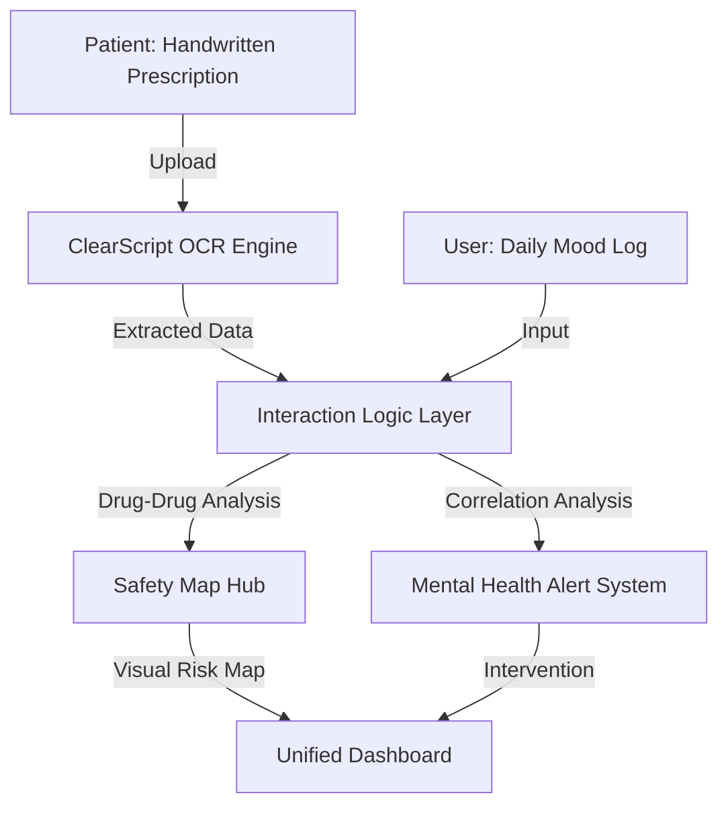

  <h1>Sanjeev AI</h1>
  
<b>An AI-Powered Platform that unifies your medications + mental health</b>

  
  
  
  
  
  

   
   

  
<i>Presented at AI UTKARSH 2026 - AI SUMMIT • Narula Institute of Technology (NiT) • Theme: Responsible AI</i>

  

    <a href="#-problem-statement">Problem Statement</a> •
    <a href="#-the-solution-sanjeev-ai">Solution</a> •
    <a href="#-core-features">Features</a> •
    <a href="#-architecture">Architecture</a> •
    <a href="#-competitive-edge">Competitive Edge</a>
  

---

## 🚩 Problem Statement

Medical errors and mental health negligence are the silent crises of modern healthcare:
- **Fragmentation**: Medications are prescribed by multiple doctors who don't talk to each other.
- **Hidden Risks**: Patients often take medications (e.g., Aspirin + Warfarin) that cause dangerous, undetected interactions.
- **Mood Correlation Gap**: Medications significantly impact mental health, yet patients rarely link their "low mood" to their "new pill."
- **Inaccessibility**: Medical reports and prescriptions are often complex, handwritten, and difficult to decipher for a layperson.

---

## 🛡️ The Solution: Sanjeev AI

**Sanjeev AI** acts as a **Personal Health Guardian Layer** that sits between you and your fragmented medical records. It uses high-accuracy AI to unify your physical treatment with your mental well-being.

### 🌌 ClearScript Scanner (OCR)
Our **Three-Layer Confidence Validation** OCR system deciphers handwritten prescriptions with 94.2% accuracy:
1. **Visual Layer**: Convolutional Neural Networks (CNN) for character recognition.
2. **Context Layer**: NLP analyzes typical drug dosages and frequency patterns.
3. **Safety Layer**: Cross-references with a global pharmacological database to ensure the drug actually exists.

### 🕸️ Safety Map™ (D3.js Powered)
An interactive, force-directed network graph that visualizes your body as a system of nodes.
- **Red Nodes**: High-risk medications.
- **Thick Lines**: Documented dangerous interactions.
- **Pulse Effect**: Real-time correlation with your reported mood swings.

---

## 🏗️ Architecture

---

## 🛠️ Tech Stack & Innovation

| Component | Technology | Innovation Point |
|-----------|------------|------------------|
| **Frontend** | React / Vite / Tailwind | Clinical-grade, high-accessibility UI |
| **Data Viz** | D3.js | Interactive Force-Directed Risk Mapping |
| **Logic** | Python / TensorFlow | Predictive Mood Correlation Engine |
| **Security** | Firebase Auth | Role-Based Access (Patient/Caregiver/Provider) |

---

## 🏆 Competitive Edge: Why Sanjeev AI?

| Feature | Generic Health Apps | Sanjeev AI |
|---------|---------------------|------------|
| **Medication Tracking** | Manual Input Only | **AI-Powered OCR (ClearScript)** |
| **Interaction Check** | Static Database | **Dynamic Visual Graph (Safety Map)** |
| **Mental Health** | Independent Journals | **Medication-Mood Correlation** |
| **Validation** | None | **Three-Layer AI Confidence Check** |

---

## 🚀 Pitch Strategy: AI UTKARSH 2026

**The Hook**: "What if the cure for your headache is the cause of your anxiety? Sanjeev AI unifies the body and mind into a single safety dashboard."

**Key Innovation**:
- **Responsible AI**: Unlike black-box models, Sanjeev AI *explains* why a combination is dangerous through the Safety Map.
- **Inclusivity**: Deciphers the "Handwriting Barrier" that keeps millions from understanding their own treatment.

---

## 👨‍💻 Developer & Visionary
**Developed for the AI UTKARSH 2026 Summit**  
*Narula Institute of Technology (NiT)*  
*Theme: Responsible AI for a Healthier Bharat*
