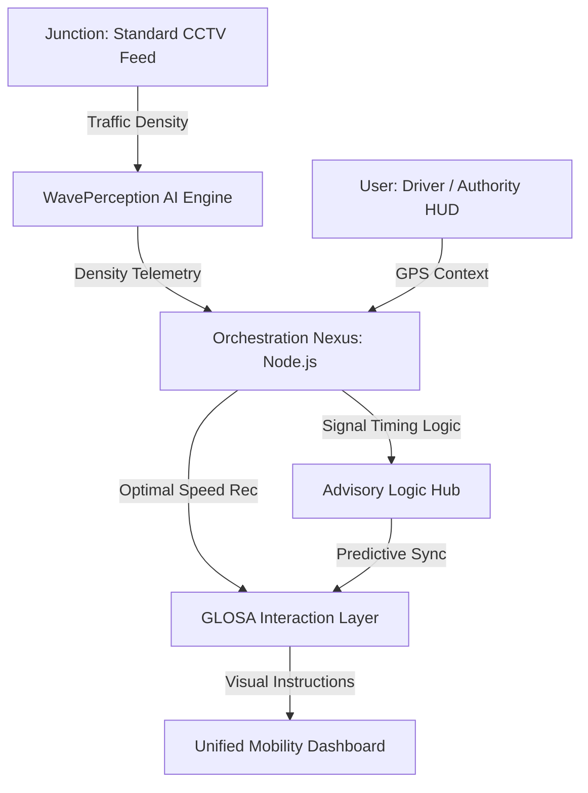

<div align="center">
  <h1>🚦 GLOSA-BHARAT</h1>
  <p><b>Intelligent Urban Mobility Ecosystem for a Self-Reliant India</b></p>
  
  
  
  
  
  

  <br />
  <br />

  <p><i>Presented at AI for Atmanirbhar Bharat Seminar 2026 • Theme: Responsible AI & Smart Mobility</i></p>

  <p>
    <a href="#-live-deployments">Live Demo</a> •
    <a href="#-architecture-schema">Architecture</a> •
    <a href="#-ai-pipeline">AI Pipeline</a> •
    <a href="#-project-structure">Structure</a> •
    <a href="#-kolkata-case-study">Kolkata Case Study</a>
  </p>
</div>

---

## 🔗 Live Deployments

| Service | URL | Platform |
|---------|-----|----------|
| 🌐 **Frontend** | [glosa-frontend.pages.dev](https://glosa-frontend.pages.dev) | Cloudflare Pages |
| ⚙️ **Backend API** | [glosa-backend-68595042977.asia-south1.run.app](https://glosa-backend-68595042977.asia-south1.run.app) | Google Cloud Run |
| 🤖 **AI Service** | [glosa-ai-68595042977.asia-south1.run.app](https://glosa-ai-68595042977.asia-south1.run.app) | Google Cloud Run |

---

## 🏗️ Architecture & Schema

### 1. System Architecture


### 2. Database Schema (MongoDB Atlas)
Sovereign health tracking of city corridors through three core collections:
- **`junctions`**: Root metadata { `id`, `name`, `lat`, `lng`, `status`, `secondsToChange`, `recommendedSpeed` }
- **`users`**: Telemetry synchronization { `uid`, `email`, `displayName`, `photoURL`, `currentLat`, `currentLng` }
- **`traffic_data`**: Historical density logs for AI training { `junction_id`, `density_index`, `throughput_count`, `timestamp` }

---

## 🧠 AI Intelligence Pipeline

Our **ClearWave AI Pipeline** executes a four-stage inference workflow:

1.  **Ingestion**: Real-time RTSP/MJPEG frame extraction from standard urban CCTV infra.
2.  **Perception**: YOLOv8-based multi-object detection (detecting lane-cutting autos, bikes, and buses).
3.  **Analytic Logic**: Python/FastAPI calculating localized queue density and arrival probability.
4.  **Prediction**: Outputting a sub-second optimized speed recommendation payload to the driver's HUD.

---

## 📂 Project Structure

```bash
GLOSA-BHARAT/
├── frontend/          # React + Vite (GIS, D3.js Charts, Advisory HUD)
├── backend/           # Node.js + Express (Orchestration & Data Sync)
├── ai-service/        # Python + FastAPI (YOLOv8 Inference Engine)
├── hardware/          # Arduino + Serial Bridge (V2I Signal Integration)
├── scripts/           # Data seeding, migration, and diagnostic tools
├── models/            # Weights and configurations for YOLOv8
└── README.md          # Enterprise Documentation
```

---

## 🌟 Key Features

- **🚀 Real-time Speed Advisory**: Calculates and displays the optimal speed to catch the next green light flawlessly.
- **🧠 Indigenous AI Core**: Custom-trained models optimized for heterogeneous Indian traffic (Bikes, Autos, Vans).
- **📊 Digital Twin Dashboard**: A futuristic Leaflet-based GIS dashboard for traffic authorities to monitor congestion and signal health.
- **🌱 Fuel & Emission Reduction**: Targeted 15-20% reduction in city-wide fuel consumption and PM2.5 emissions.
- **🛰️ Hardware-Agnostic**: Works with existing government CCTV infrastructure—no expensive LIDAR needed.

---

## 🗺️ Kolkata Case Study: Girish Park to NIT Narula

> **Developer's Route**: Ashish Chaurasia | **Distance**: 8.7 km | **Junctions**: 7  
> **Route Corridor**: Girish Park → Shyambazar 5-Point → Sinthi More → Dunlop → Agarpara

| # | Junction | Vehicle Density | Red Duration | Annual Fuel Waste |
|---|----------|-----------------|--------------|-------------------|
| 1 | Girish Park Metro | High | 120s | 1.78L Litres |
| 2 | Shyambazar 5-Point | Very High | 160s | 3.12L Litres |
| 3 | Sinthi More Junction | High | 130s | 1.98L Litres |
| 4 | Dunlop Crossing | Very High | 140s | 2.67L Litres |
| 5 | Belgharia Junction | Medium | 110s | 1.43L Litres |
| 6 | Agarpara Medical | Medium | 115s | 1.12L Litres |
| 7 | NIT Narula Turn | Low | 80s | 0.54L Litres |

---

## 🏆 Competitive Matrix: Existing vs GLOSA-BHARAT

| Feature | Generic Traffic Systems | GLOSA-BHARAT |
|---------|-------------------------|--------------|
| **Deployment Cost** | ₹ ₹ ₹ ₹ (Requires LIDAR/Sensors) | **₹ (Zero-cost Hardware Integration)** |
| **Traffic Handling** | Lane-disciplined only | **Heterogeneous Indian Traffic Ready** |
| **Data Privacy** | Foreign Cloud Dependency | **Sovereign Local Server Architecture** |
| **Goal** | Simple Monitoring | **Active Fuel & Emission Optimization** |

---

## 🚀 Impact & Benefits

- **🌏 Global Ecology**: Targeted reduction in particulate matter (PM2.5) by minimizing idling.
- **📈 Economic Gains**: Saving city-wide logistics providers 15-20% in annual fuel costs.
- **🇮🇳 Sovereign Resilience**: 100% indigenous software stack sitting on secure Indian clouds.

---

## 👨‍💻 Developer & Visionary
**Developed for the AI for Atmanirbhar Bharat Seminar 2026**   
*Developed as part of the National Mobility Initiative.*
