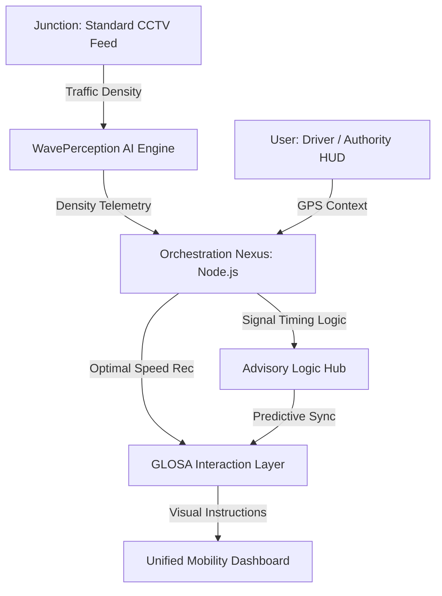
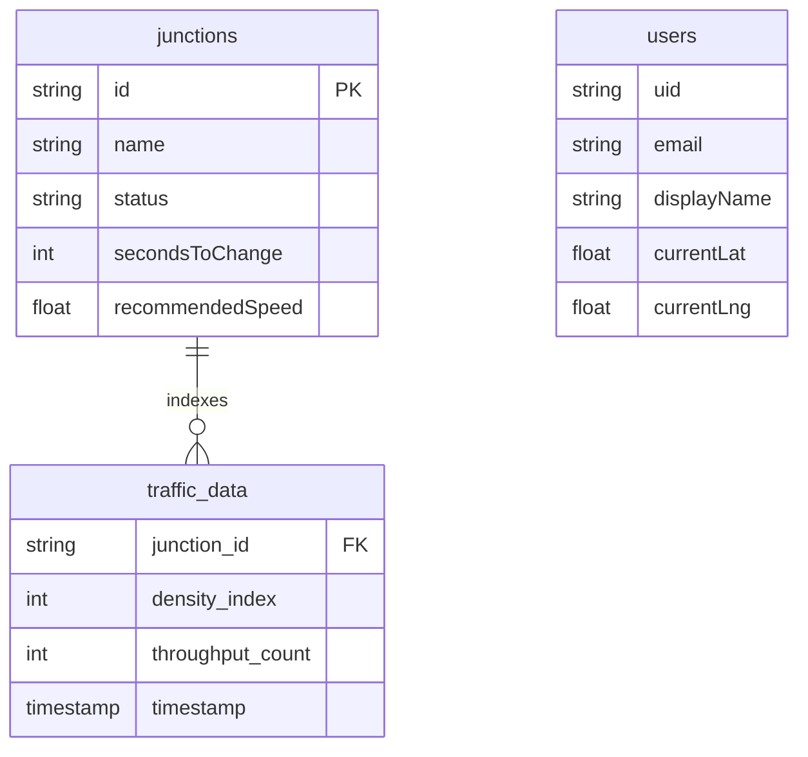

<div align="center">
  <h1>🚦 GLOSA BHARAT</h1>
  <p><b>Intelligent Urban Mobility Ecosystem for a Self-Reliant India</b></p>
  
  
  
  
  
  

  <br />
  <br />

  <p><i>Presented at AI UTKARSH 2026 - AI SUMMIT • Narula Institute of Technology (NiT) • Theme: Responsible AI</i></p>

  <p>
    <a href="#-what-is-glosa-bharat">About</a> •
    <a href="#-live-deployments">Live Demo</a> •
    <a href="#-architecture-diagrams">Architecture</a> •
    <a href="#-anatomy-of-the-project">Project Structure</a>
  </p>
</div>

---

## ❓ What is GLOSA BHARAT?

**GLOSA BHARAT** (Green Light Optimal Speed Advisory) is a high-fidelity **Vehicle-to-Infrastructure (V2I)** ecosystem designed to eliminate urban traffic friction and fuel wastage using indigenous AI. 

It acts as a **Personal Mobility Guardian**, synchronizing your driving speed with city traffic signals. By using real-time AI perception from existing CCTV cameras, the system calculates the "Optimal Speed" you should maintain to reach a junction exactly when the signal turns green—creating a seamless **"Green Wave"** corridor that saves time, reduces fuel consumption, and prevents unnecessary signal-jump challans.

---

## 🔗 Live Deployments

| Service | URL | Platform |
|---------|-----|----------|
| 🌐 **Frontend** | [glosa-frontend.pages.dev](https://glosa-frontend.pages.dev) | Cloudflare Pages |
| ⚙️ **Backend API** | [glosa-backend-68595042977.asia-south1.run.app](https://glosa-backend-68595042977.asia-south1.run.app) | Google Cloud Run |
| 🤖 **AI Service** | [glosa-ai-68595042977.asia-south1.run.app](https://glosa-ai-68595042977.asia-south1.run.app) | Google Cloud Run |

---

## 🚩 Problem Statement

Urban centers in India face a silent economic and environmental crisis driven by traffic friction:
- **Economic Loss**: Idling at red lights costs billions in lost productivity and fuel imports.
- **Environmental Impact**: Vehicular "stop-and-go" patterns are a primary source of urban CO2 and PM2.5 hotspots.
- **Unnecessary Challans**: Drivers often face automated fines (e-challans) for technical signal jumps caused by poor signal visibility or unexpected timing flips.
- **Inflexible Infrastructure**: Current traffic signal systems are "pre-timed" and cannot adapt to real-time traffic density.
- **Energy Insecurity**: High national fuel consumption is exacerbated by inefficient driving habits in congested corridors.

---

## 🏗️ Architecture Diagrams

### 1. System Architecture (High-Level)


---

## 🧠 AI Intelligence Pipeline

The **ClearWave AI Pipeline** executes a structured four-stage inference workflow:


---

## 🗄️ Database Schema

Sovereign telemetry tracking through three core collections in MongoDB Atlas:



---

## 🔎 Anatomy of the Project

```bash
GLOSA-BHARAT/
├── ai-service/              # Python Intelligence Layer
│   ├── main.py              # FastAPI server & route definitions
│   ├── model_loader.py      # YOLOv8 weight loading orchestration
│   ├── inference_logic.py   # Traffic density calculation algorithms
│   └── requirements.txt     # Python dependency manifest
├── backend/                 # Node.js Orchestration Tier
│   ├── index.js             # Main server entry point
│   ├── models/              # Mongoose schemas (Junctions, Users)
│   ├── routes/              # API endpoints for telemetry sync
│   └── package.json         # Backend manifest
├── frontend/                # React Fiber Interface
│   ├── src/
│   │   ├── components/      # Advisory HUD & GIS Map modules
│   │   ├── pages/           # Dashboard, Landing & Auth views
│   │   ├── App.jsx          # Routing & State Management
│   │   └── index.css        # Global futuristic styling
│   ├── public/              # Static assets & GIS icons
│   └── vite.config.js       # Vite configuration
├── hardware/                # V2I Physical Prototype (Arduino)
│   ├── glosa_hardware/
│   │   └── glosa_hardware.ino # LCD/LED Signal Simulation C++ code
│   └── serial_bridge.py      # Laptop-to-Hardware serial communicator
├── scripts/                 # DevOps & Utility Scripts
│   ├── seed_junctions.js    # Initializing MongoDB traffic data
│   └── deploy_cloud.sh      # Google Cloud Run deployment automation
└── README.md                # Multi-modal Enterprise Documentation
```

---

## 🌟 Key Features & Solutions

- **🚀 Real-time Speed Advisory**: Calculates and displays the optimal speed to catch the next green light flawlessly, **eliminating unintentional signal jumps**.
- **🧠 Indigenous AI Core**: Custom-trained models optimized for heterogeneous Indian traffic (Bikes, Autos, Vans).
- **🛡️ Challan Mitigation**: Precise V2I synchronization ensures drivers are never caught in "dilemma zones," reducing unnecessary fines.
- **📊 Digital Twin Dashboard**: A futuristic Leaflet-based GIS dashboard for traffic authorities to monitor congestion and signal health.
- **🛰️ Hardware-Agnostic**: Works with existing government CCTV infrastructure—no expensive LIDAR needed.

---

## 🗺️ Kolkata Case Study: Girish Park to NIT Narula

> **Developer's Route**: Ashish Chaurasia | **Distance**: 8.7 km | **Junctions**: 7  
> **Route Corridor**: Girish Park → Shyambazar 5-Point → Sinthi More → Dunlop → Agarpara

| # | Junction | Vehicle Density | Red Duration | Annual Fuel Waste |
|---|----------|-----------------|--------------|-------------------|
| 1 | Girish Park Metro | High | 120s | 1.78L Litres |
| 2 | Shyambazar 5-Point | Very High | 160s | 3.12L Litres |
| 3 | Sinthi More Junction | High | 130s | 1.98L Litres |
| 4 | Dunlop Crossing | Very High | 140s | 2.67L Litres |
| 5 | Belgharia Junction | Medium | 110s | 1.43L Litres |
| 6 | Agarpara Medical | Medium | 115s | 1.12L Litres |
| 7 | NIT Narula Turn | Low | 80s | 0.54L Litres |

---

## 🚀 Impact & Benefits

- **🛡️ Legal Protection**: Prevents unnecessary e-challans by removing the "stop-go" guesswork at yellow lights.
- **🌏 Global Ecology**: Targeted reduction in particulate matter (PM2.5) by minimizing idling.
- **📈 Economic Gains**: Saving city-wide logistics providers 15-20% in annual fuel costs.
- **🇮🇳 Sovereign Resilience**: 100% indigenous software stack sitting on secure Indian clouds.

---

## 👨‍💻 Developer & Visionary
**Presented at AI UTKARSH 2026 - AI SUMMIT**   
*Narula Institute of Technology (NiT) • Theme: Responsible AI*
