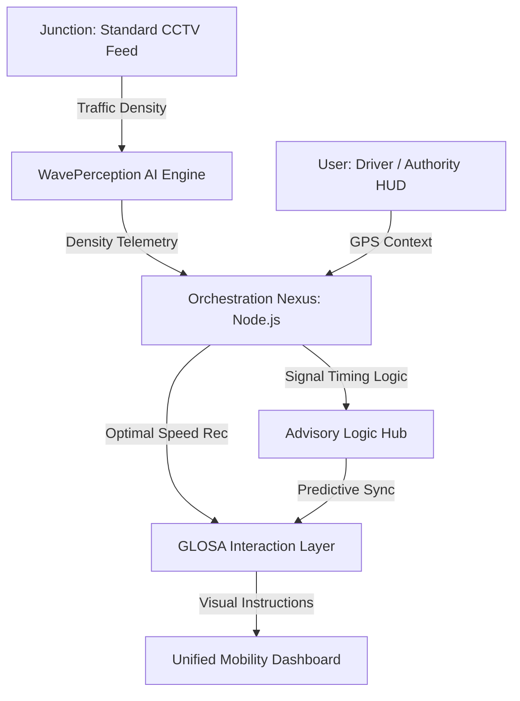

  <h1>🚦 GLOSA-BHARAT 2.0</h1>
  
<b>Intelligent Urban Mobility Ecosystem for a Self-Reliant India</b>

  
  
  
  
  
  

   
   

  
<i>Presented at AI for Atmanirbhar Bharat Seminar 2026 • Theme: Responsible AI & Smart Mobility</i>

  

    <a href="#-live-deployments">Live Demo</a> •
    <a href="#-problem-statement">Problem</a> •
    <a href="#-solutions--use-of-ai">AI Innovation</a> •
    <a href="#-impact--benefits">Impact</a> •
    <a href="#-kolkata-case-study">Kolkata Case Study</a>
  

---

## 🔗 Live Deployments

| Service | URL | Platform |
|---------|-----|----------|
| 🌐 **Frontend** | [glosa-frontend.pages.dev](https://glosa-frontend.pages.dev) | Cloudflare Pages |
| ⚙️ **Backend API** | [glosa-backend-68595042977.asia-south1.run.app](https://glosa-backend-68595042977.asia-south1.run.app) | Google Cloud Run |
| 🤖 **AI Service** | [glosa-ai-68595042977.asia-south1.run.app](https://glosa-ai-68595042977.asia-south1.run.app) | Google Cloud Run |

> **Note**: These are live endpoints running on Google's highly-available serverless infrastructure (asia-south1 region).

---

## 🚩 Problem Statement

Urban centers in India face a silent economic and environmental crisis driven by traffic friction:
- **Economic Loss**: Idling at red lights costs billions in lost productivity and fuel imports.
- **Environmental Impact**: Vehicular "stop-and-go" patterns are a primary source of urban CO2 and PM2.5 hotspots.
- **Inflexible Infrastructure**: Current traffic signal systems are "pre-timed" and cannot adapt to real-time traffic density.
- **Energy Insecurity**: High national fuel consumption is exacerbated by inefficient driving habits in congested corridors.

---

## 🌟 Key Features

- **🚀 Real-time Speed Advisory**: Calculates and displays the optimal speed to catch the next green light flawlessly.
- **🧠 Indigenous AI Core**: Custom-trained models optimized for heterogeneous Indian traffic (Bikes, Autos, Vans).
- **📊 Digital Twin Dashboard**: A futuristic Leaflet-based GIS dashboard for traffic authorities to monitor congestion and signal health.
- **⚡ Low-Latency Orchestration**: High-speed Node.js middleware for sub-second data routing.
- **🌱 Fuel & Emission Reduction**: Targeted 15-20% reduction in fuel consumption and city-wide PM2.5 emissions.
- **🛰️ Hardware-Agnostic**: works with existing government CCTV infrastructure—no expensive LIDAR needed.

---

## 👥 Target User Segments

1.  **Urban Commuters**: Direct-to-consumer app for stress-free, fuel-efficient daily travel.
2.  **Logistics & Fleet Operators**: Organizations like Zomato, Swiggy, and Amazon tracking corridor efficiency.
3.  **Public Transport (TSP)**: Enabling "Transit Signal Priority" for buses and metro feeder services.
4.  **Smart City Authorities**: Providing a "God-eye view" for traffic flow management and bottleneck identification.

---

## 🧠 Solutions & Use of AI in GLOSA-BHARAT

**GLOSA-BHARAT** uses a high-accuracy, three-layer AI orchestration system to harmonize vehicles with infrastructure:

### 1. Perception Logic (WavePerception)
Utilizes **YOLOv8** to analyze standard CCTV feeds. AI performs:
- **Object Localization**: Distinguishing between 14 different vehicle classes in high-density Indian environments.
- **Queue Density Mapping**: Real-time pixel-level calculation of vehicle backup at junctions.

### 2. Computational Advisor (GLOSA Logic)
Synthesizes telemetry data using a predictive mathematical framework:
- **Phase Forecasting**: predicting exactly when a signal will change based on historical and real-time density.
- **Optimal Speed Mapping**: Calculating `V_opt = Distance / (Time_to_Flip)` with a safety-first buffer.

### 3. Sustainability AI
Predicts the environmental impact of individual journeys, providing "Eco-Scores" to drivers to incentivize smooth mobility.

---

## 🏗️ Architecture

---

## 🛠️ Tech Stack & Innovation

| Component | Technology | Innovation Point |
|-----------|------------|------------------|
| **Frontend** | React / Leaflet / Framer | Futuristic, low-distraction "Control Room" HMI |
| **Backend** | Node.js / Express | Sub-second latency orchestration for V2I |
| **Edge AI** | Python / YOLOv8 / FastAPI | Trained on diverse, unlane-led Indian traffic patterns |
| **Connectivity** | V2I Serial Bridge | Seamless integration with legacy signal controllers |

---

## 🏆 Competitive Edge: Existing vs GLOSA-BHARAT

| Feature | Generic Signal Systems | GLOSA-BHARAT |
|---------|-------------------------|--------------|
| **Deployment Cost** | ₹ ₹ ₹ ₹ (Requires LIDAR/Sensors) | **₹ (Zero-cost Hardware Integration)** |
| **Traffic Handling** | Lane-disciplined/Binary | **Heterogeneous Indian Traffic Ready** |
| **Data Privacy** | Foreign Cloud Dependency | **Sovereign Local Server Architecture** |
| **Driver Awareness** | None (Static countdowns) | **Active Advisory (Optimal Speed)** |
| **Sustainability** | Passive Monitoring | **Active Fuel & Emission Optimization** |

---

## 🗺️ Kolkata Case Study: Girish Park to NIT Narula

> **Developer's Route**: Ashish Chaurasia | **Distance**: 8.7 km | **Junctions**: 7  
> **Route Corridor**: Girish Park → Shyambazar → BT Road → Dunlop → NIT Narula, Agarpara

| # | Junction | Vehicle Density | Red Duration | Annual Fuel Waste |
|---|----------|-----------------|--------------|-------------------|
| 1 | Girish Park Metro | High | 120s | 1.78L Litres |
| 2 | Shyambazar 5-Point | Very High | 160s | 3.12L Litres |
| 3 | Sinthi More Junction | High | 130s | 1.98L Litres |
| 4 | Dunlop Crossing | Very High | 140s | 2.67L Litres |
| 5 | Belgharia Junction | Medium | 110s | 1.43L Litres |
| 6 | Agarpara Medical | Medium | 115s | 1.12L Litres |
| 7 | NIT Narula Turn | Low | 80s | 0.54L Litres |

**Impact with GLOSA**: Travel time reduced from **38 min → 26 min (-12 min)**, achieving an average fuel saving of 18%.

---

## 🚀 Impact & Benefits

- **🌏 Global Ecology**: Significant reduction in urban particulate matter (PM2.5).
- **📉 Economic Gains**: Targeted 15-20% reduction in city-wide logistics fuel costs.
- **🏎️ Fluid Mobility**: Achieving the "Green Wave" corridor vision across Indian Smart Cities.
- **🇮🇳 Sovereign Resilience**: 100% indigenous software stack sitting on local servers.

---

## 👨‍💻 Developer & Visionary
**Developed for the AI for Atmanirbhar Bharat Seminar 2026**   
*Developed as part of the National Mobility Initiative.*
