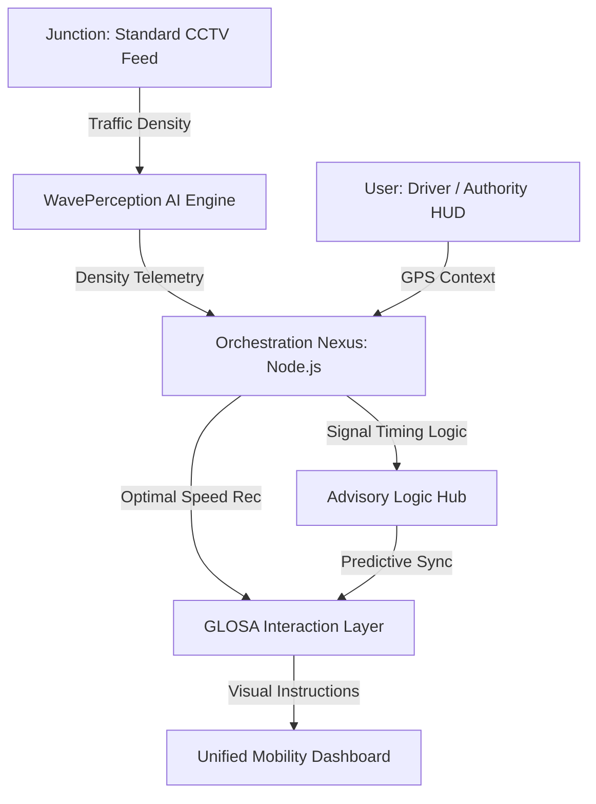
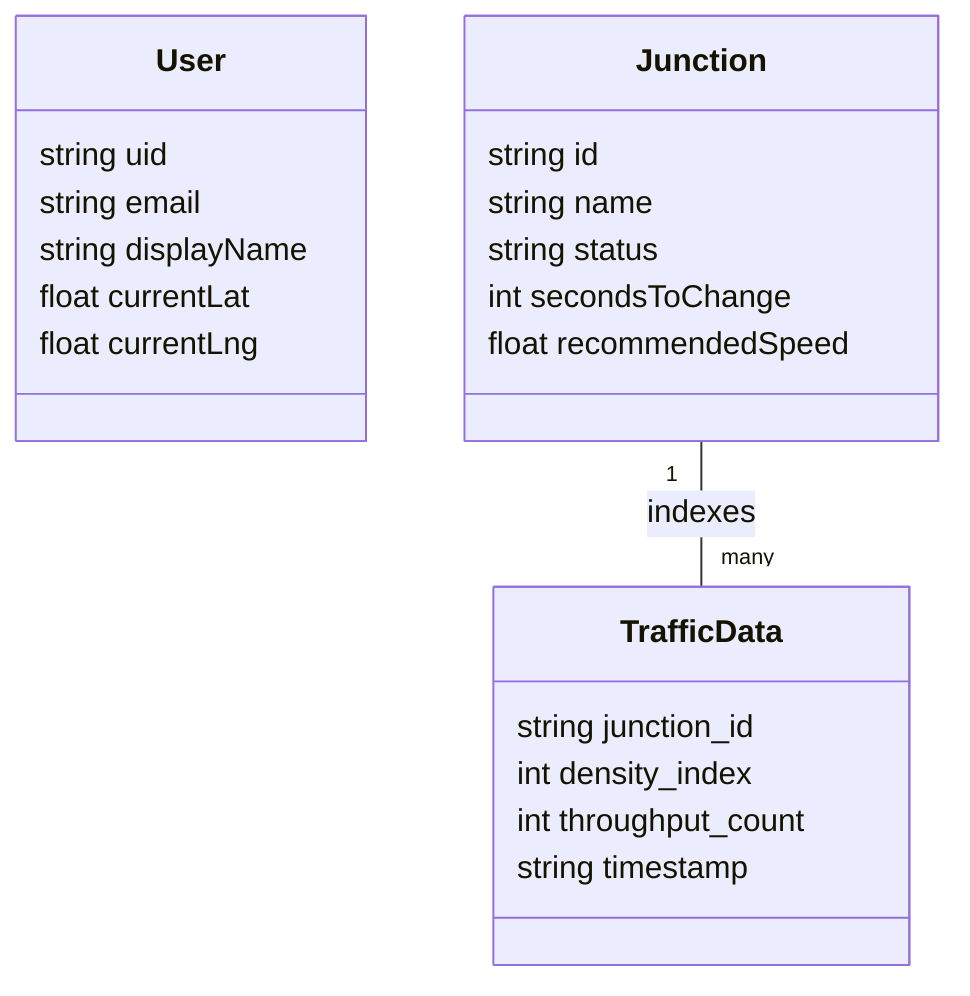

<div align="center">
  <h1>🚦 GLOSA BHARAT</h1>
  <p><b>Intelligent Urban Mobility Ecosystem for a Self-Reliant India</b></p>
  
  
  
  
  
  

  <br />
  <br />

  <p><i>Presented at AI UTKARSH 2026 - AI SUMMIT • Narula Institute of Technology (NiT) • Theme: Responsible AI</i></p>

  <p>
    <a href="#-what-is-glosa-bharat">About</a> •
    <a href="#-live-deployments">Live Demo</a> •
    <a href="#-key-features--solutions">Features</a> •
    <a href="#-architecture-diagrams">Architecture</a> •
    <a href="#-anatomy-of-the-project">Structure</a>
  </p>
</div>

---

## 📖 What is GLOSA BHARAT?

Urban commuters today sit in "stop-and-go" traffic, consuming unnecessary fuel and contributing to rising urban emissions. Traffic signals are often pre-timed, ignoring real-time vehicle density, and drivers frequently face e-challans for unintentional signal jumps due to poor visibility.

**GLOSA BHARAT** is an intelligent safety and mobility layer that connects your vehicle with city infrastructure. By building a sub-second unified view of traffic junctions, it actively prevents congestion and fuel waste before you even reach the signal.

---

## 🚨 Problem Statement

> **The Urban Mobility Crisis**

1.  **Fuel Wastage**: Constant idling at red lights significantly increases city-wide fuel dependency and financial loss.
2.  **Unnecessary Challans**: Poor signal timing/visibility causes unintentional signal jumps, leading to legal and financial burdens.
3.  **Static Infrastructure**: Legacy traffic lights don't adapt to real-time density, creating permanent bottlenecks in major corridors.

*Result: Economic leakage, increased carbon footprint, and high-stress urban commuting.*

---

## 🎯 Objective

Build an **AI-powered mobility layer** that comprehensively connects heterogeneous traffic with signal infrastructure to:

- Detect live junction density via standard CCTV feeds instantly.
- Identify optimal speed windows to eliminate unnecessary idling.
- Correlate vehicle telemetry with precise signal flip timings.
- Provide a truly unified view of the traffic corridor for both drivers and authorities.

➡️ **Goal: Eliminate city-wide "stop-and-go" patterns before they cause gridlock.**

---

## 💡 The Solution

**GLOSA BHARAT** is the first platform that unites a city's traffic perception under one intelligent roof:

1.  **AI-Powered WavePerception Engine**: Rapidly scans CCTV feeds via YOLOv8 for instantaneous object detection and queue indexing.
2.  **Predictive Advisor Hub**: Uses sub-second logic to calculate the perfect KM/H to catch the "Green Wave."
3.  **V2I Serial Bridge**: Synchronizes cloud-based AI with legacy signal controllers on the ground.

---

## 🏗️ Architecture Diagrams

### 1. System Architecture (High-Level)


### 🧠 AI Intelligence Pipeline


---

## 📚 Technical Foundation

### 1. Technology Stack

| Layer | Responsibility | Technologies |
|-------|----------------|--------------|
| **Frontend** | GIS Dashboard & Driver HUD | React, Vite, Leaflet, Google Maps API, Framer Motion |
| **Backend** | API Orchestration | Node.js, Express.js |
| **Database** | Telemetry Storage | MongoDB Atlas |
| **AI Intelligence** | Perception & Optimization | Python, YOLOv8, FastAPI |
| **Hardware Bridge** | Physical V2I Simulation | Arduino (C++), Serial Communications |

### 2. Database Schema (MongoDB Atlas)


---

## 🔎 Anatomy of the Project

```bash
GLOSA-BHARAT/
├── ai-service/              # Python Intelligence Layer
│   ├── main.py              # FastAPI server & route definitions
│   ├── model_loader.py      # YOLOv8 weight loading orchestration
│   ├── inference_logic.py   # Traffic density calculation algorithms
│   └── requirements.txt     # Python dependency manifest
├── backend/                 # Node.js Orchestration Tier
│   ├── index.js             # Main server entry point
│   ├── models/              # Mongoose schemas (Junctions, Users)
│   ├── routes/              # API endpoints for telemetry sync
│   └── package.json         # Backend manifest
├── frontend/                # React Fiber Interface
│   ├── src/
│   │   ├── components/      # Advisory HUD & GIS Map modules
│   │   ├── pages/           # Dashboard, Landing & Auth views
│   │   ├── App.jsx          # Routing & State Management
│   │   └── index.css        # Global futuristic styling
│   ├── public/              # Static assets & GIS icons
│   └── vite.config.js       # Vite configuration
├── hardware/                # V2I Physical Prototype (Arduino)
│   ├── glosa_hardware/
│   │   └── glosa_hardware.ino # LCD/LED Signal Simulation C++ code
│   └── serial_bridge.py      # Laptop-to-Hardware serial communicator
├── scripts/                 # DevOps & Utility Scripts
│   ├── seed_junctions.js    # Initializing MongoDB traffic data
│   └── deploy_cloud.sh      # Google Cloud Run deployment automation
└── README.md                # Multi-modal Enterprise Documentation
```

---

## 🌟 Key Features & Solutions

- **🚀 Real-time Speed Advisory**: Calculates and displays the optimal speed to catch the next green light flawlessly, eliminating unintentional signal jumps.
- **🧠 Indigenous AI Core**: Custom-trained models optimized for heterogeneous Indian traffic (Bikes, Autos, Vans).
- **🛡️ Challan Mitigation**: Precise V2I synchronization ensures drivers are never caught in "dilemma zones," reducing unnecessary fines.
- **📊 Digital Twin Dashboard**: A futuristic Leaflet/Google-based GIS dashboard for traffic authorities to monitor congestion and signal health.
- **📡 Hardware-Agnostic**: Works with existing government CCTV infrastructure—no expensive LIDAR needed.

---

## 🗺️ Kolkata Case Study: Girish Park to NIT Narula

> **Developer's Route**: Ashish Chaurasia | **Distance**: 8.7 km | **Junctions**: 7  
> **Route Corridor**: Girish Park → Shyambazar 5-Point → Sinthi More → Dunlop → Agarpara

| # | Junction | Vehicle Density | Red Duration | Annual Fuel Waste |
|---|----------|-----------------|--------------|-------------------|
| 1 | Girish Park Metro | High | 120s | 1.78L Litres |
| 2 | Shyambazar 5-Point | Very High | 160s | 3.12L Litres |
| 3 | Sinthi More Junction | High | 130s | 1.98L Litres |
| 4 | Dunlop Crossing | Very High | 140s | 2.67L Litres |
| 5 | Belgharia Junction | Medium | 110s | 1.43L Litres |
| 6 | Agarpara Medical | Medium | 115s | 1.12L Litres |
| 7 | NIT Narula Turn | Low | 80s | 0.54L Litres |

---

## 🚀 Impact & Benefits

- **🛡️ Legal Protection**: Prevents unnecessary e-challans by removing the "stop-go" guesswork at yellow lights.
- **🌏 Global Ecology**: Targeted reduction in particulate matter (PM2.5) by minimizing idling.
- **📉 Economic Gains**: Saving city-wide logistics providers 15-20% in annual fuel costs.
- **🇮🇳 Sovereign Resilience**: 100% indigenous software stack sitting on secure Indian clouds.

---

## 👨‍💻 Developer & Visionary
**Presented at AI UTKARSH 2026 - AI SUMMIT**   
*Narula Institute of Technology (NiT) • Theme: Responsible AI*
