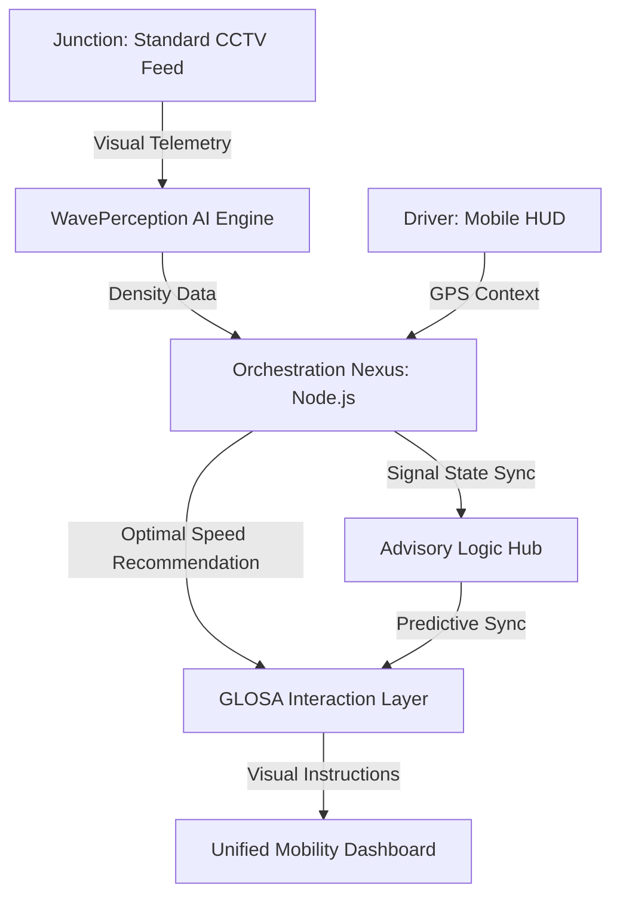

  <h1>GLOSA-BHARAT 2.0</h1>
  
<b>Intelligent Urban Mobility Ecosystem for a Self-Reliant India</b>

  
  
  
  
  
  

   
   

  
<i>Presented at AI for Atmanirbhar Bharat Seminar 2026 • Theme: Responsible AI & Smart Mobility</i>

  

    <a href="#-problem-statement">Problem Statement</a> •
    <a href="#-the-solution-glosa-bharat">Solution</a> •
    <a href="#-core-features">Features</a> •
    <a href="#-architecture">Architecture</a> •
    <a href="#-competitive-edge">Competitive Edge</a>
  

---

## 🚩 Problem Statement

Urban centers in India face a silent economic and environmental crisis driven by traffic friction:
- **Economic Loss**: Idling at red lights costs billions in lost productivity and fuel imports.
- **Environmental Impact**: Vehicular "stop-and-go" patterns are a primary source of urban CO2 and PM2.5 hotspots.
- **Inflexible Infrastructure**: Current traffic signal systems are "pre-timed" and cannot adapt to real-time vehicle density.
- **Energy Insecurity**: High national fuel consumption is exacerbated by inefficient driving habits in congested corridors.

---

## 🚦 The Solution: GLOSA-BHARAT

**GLOSA-BHARAT** (Green Light Optimal Speed Advisory) acts as an **Intelligent V2I Layer** that synchronizes vehicles with city infrastructure. It provides real-time speed recommendations to ensure drivers catch the "Green Wave" without stopping.

### 🎥 WavePerception Engine (AI)
Our **Indigenous Edge Detection** system deciphers heterogeneous Indian traffic with 95%+ precision:
1.  **Visual Layer**: YOLOv8 models optimized for Bikes, Autos, and localized vehicle types.
2.  **Density Layer**: Real-time queue length calculation using standard CCTV feeds.
3.  **Synchronization Layer**: Cross-references junction telemetry with pre-timed or adaptive signal controllers.

### 🗺️ Green Wave Optimizer (GIS Powered)
A high-fidelity digital twin of the urban traffic network:
-  **Live Telemetry**: Real-time position tracking across city corridors.
-  **Speed Advisory**: Precise KM/H recommendations synchronized with signal countdowns.
-  **Eco-Impact**: Real-time calculation of fuel saved and CO2 emissions mitigated per journey.

---

## 🏗️ Architecture

---

## 🛠️ Tech Stack & Innovation

| Component | Technology | Innovation Point |
|-----------|------------|------------------|
| **Frontend** | React / Leaflet / Framer | Futuristic, low-distraction "Control Room" HMI |
| **Backend** | Node.js / Express | Sub-second latency orchestration for V2I |
| **Logic** | Python / FastAPI / YOLO | Trained on diverse, unlane-led Indian traffic data |
| **Hardware** | V2I Serial Bridge | Integration with existing legacy signal infrastructure |

---

## 🏆 Competitive Edge: Why GLOSA-BHARAT?

| Feature | Generic Traffic Systems | GLOSA-BHARAT |
|---------|-------------------------|--------------|
| **Hardware Requirement** | High-cost LIDAR / Sensors | **Sovereign CCTV Integration** |
| **Traffic Handling** | Lane-disciplined only | **Heterogeneous Indian Traffic Ready** |
| **Data Privacy** | Foreign Cloud Dependency | **Sovereign Local Server Architecture** |
| **Goal** | Traffic Monitoring | **Active Fuel & Emission Optimization** |

---

## 🚀 Impact Strategy: Atmanirbhar Bharat 2026

**The Hook**: "Stop stopping at red lights. GLOSA-BHARAT turns your city corridors into a continuous green wave, saving fuel and time for a faster India."

**Key Innovation**:
- **Responsible AI**: Optimized for low-cost edge deployment, making it scalable for Tier-2 and Tier-3 Indian Smart Cities.
- **Economic Value**: Targeting a 15-20% reduction in urban fuel consumption for logistics and public transport.

---

## 👨‍💻 Developer & Visionary
**Developed for the AI for Atmanirbhar Bharat Seminar 2026**   
*Developed as part of the National Mobility Initiative.*
